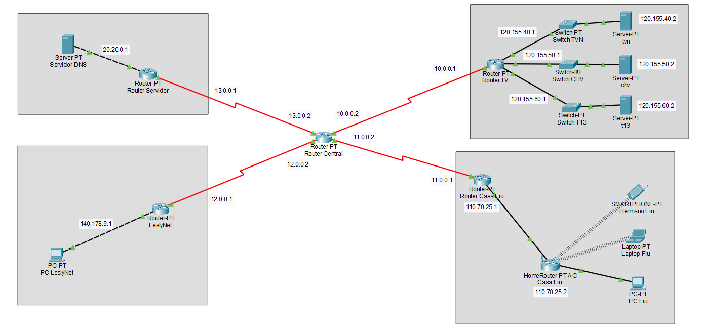

# Network Configuration and Simulation in Cisco Packet Tracer

## Context

This project was carried out during the second semester of 2023 as part of a Networking course. The goal was to configure and simulate a network using **Cisco Packet Tracer 8.2.11**, adhering to specific requirements and constraints.



## Description

The task involves setting up and simulating four distinct subnets, establishing connectivity between them using static routing. The network consists of:

- **Casa de Fiu**
- **DNS Server**
- **Transmission Networks (TVN, CHV, T13)**
- **LeslyNet**

Each subnet has specific configuration rules for IP addressing, routing, and communication. The project also involves answering technical questions based on network simulation results.

## Requirements

- **Cisco Packet Tracer 8.2.11**
  - Download it [here](https://www.netacad.com/courses/packet-tracer).
- A PC or laptop capable of running Cisco Packet Tracer.
  
### Subnet Configuration Requirements

1. **DNS Network**
   - Must include a DNS server with the IP `20.20.0.2`, which resolves the domains for `www.tvn.cl`, `www.chv.cl`, and `www.t13.cl`.
   - Static routing must be used.

2. **Transmission Networks (TVN, CHV, T13)**
   - Each network hosts a web server with static IPs (`120.155.40.2`, `120.155.50.2`, `120.155.60.2`).
   - Each server should respond with a welcome HTML page.

3. **Casa de Fiu**
   - Includes devices like a desktop, laptop, and phone, all connected via DHCP with IPs from `160-170`.
   - The router should block TVN traffic for the brother's phone during 23:00-02:00.

4. **LeslyNet**
   - Contains a user connected through an ethernet crossover cable.
   - The network must block access to the T13 server.

## Network Simulation

The project requires the simulation of network behavior using Cisco Packet Tracer's simulation mode. Here, different network packets (ICMP, HTTP, etc.) will be inspected to understand their behavior across layers and paths.

### Simulation Steps

1. **Simple PDU Simulation** (ICMP packet)
   - Send an ICMP packet from a device in Casa de Fiu to the DNS server. Ensure that the packet travels through the network and returns successfully.

2. **Complex Packet Simulation** (HTTP, TCP)
   - From the Casa de Fiu network, connect to the CHV server and inspect the HTTP and TCP packets.

## Setup Instructions

1. Download and install **Cisco Packet Tracer**.
2. Open the provided `.pkt` file in Cisco Packet Tracer.
3. Simulate the network by sending packets between the devices as specified in the simulation steps.
4. Inspect packet routes and answer the questions provided in the README file.

## How to Run

1. Open Cisco Packet Tracer and load the `.pkt` file.
2. Use the "Simulation" mode to send packets between devices.
3. For the **Simple PDU Simulation**:
   - Choose a device in **Casa de Fiu** and send a packet to the DNS server.
4. For the **Complex Packet Simulation**:
   - Access **`www.chv.cl`** from a laptop in **Casa de Fiu**.
5. Monitor the packets in the event list and analyze their behavior.

## Examples

Here are examples of the expected output from the simulations:

### Simple PDU (ICMP)

- **ICMP Packet**: Sent from the desktop in **Casa de Fiu** to the DNS server.
- **Response**: The packet should return successfully to the sender.

### HTTP/TCP Packet (Web Access)

- **Request**: Connect to `www.chv.cl` from the laptop in **Casa de Fiu**.
- **Response**: The web server should respond with the message:

  ```html
  <h1>Welcome to the Pan-American Games by CHV!</h1>
  ```
